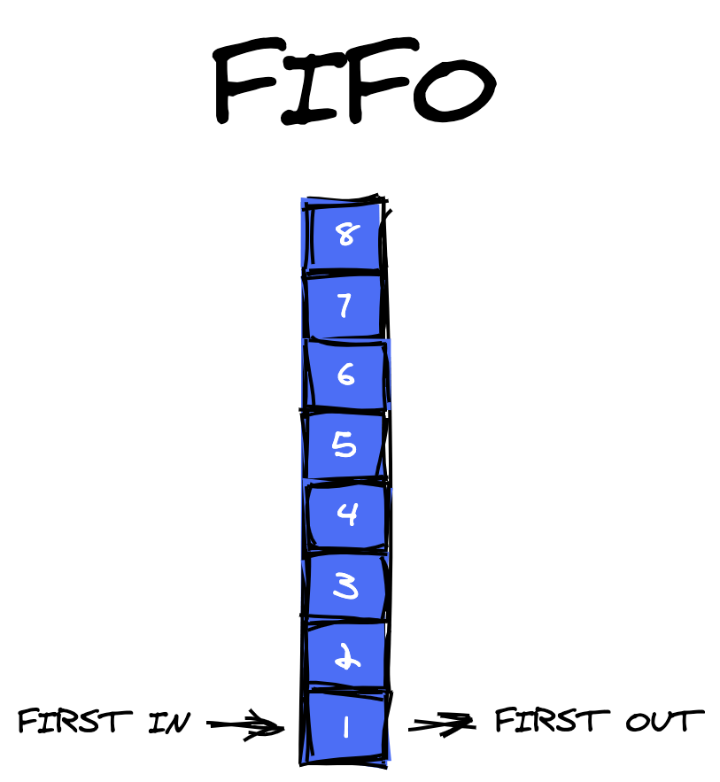
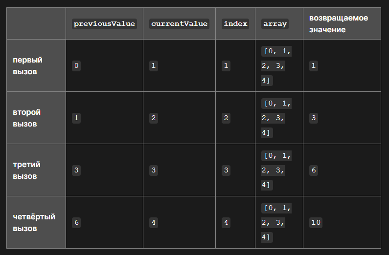

# Data Structure in Javascript

## Stack and Queue

**Queues** follow the First In First Out pattern. In short: FIFO - first in, first out



```js
const queueArray = [];
queueArray.push(6);
queueArray.push(8);

// queueArray = [6, 8]

queueArray.shift();

// queueArray = [8]
```

**Stacks** are linear data structures, they follow Last In First Out pattern. In short: LIFO - last in, first out


```js
const stackArray = [];
stackArray.push(4);
stackArray.push(12);
stackArray.push(8);

// stackArray = [4, 12, 8]

stackArray.pop();

// stackArray = [4, 12]
```

---

## Immutable

Immutable is an object whose state cannot be changed after creation. The result of modifying an immutable object will be a new object

Ex, method slice returns a shallow copy of a portion of an array into a new array

```js
const immutableArray = [2, 8, 6, 12, 16, 4];
const slicedArray = immutableArray.slice(0, 4);

// slicedArray = [2, 8, 6, 12]
// immutableArray = [2, 8, 6, 12, 16, 4]
```

But methods: pop, push, shift, unshift, sort, reverse — modify an current array

```js
const mutableArray = [2, 8, 6, 12, 16, 4];
const reversedArray = mutableArray.reverse();

// reversedArray = [4, 16, 12, 6, 8, 2]
// mutableArray = [4, 16, 12, 6, 8, 2]
```

How to clone an _array_ and keep the immutability property?

```js
const array = [4, 12, 8, 24];
const clonedArray = [...array];
```

How to clone an _object_ and keep the immutability property?

```js
const immutableObject = {
  a: 12,
  b: 16,
  c: 8,
  d: 4,
};

// clone with spread
const clonedObject = { ...immutableObject };

// clone with Object.assign
const clonedObject = Object.assign({}, immutableObject);

// clone with Object.freeze
Object.freeze(immutableObject);
const modufiedObject = immutableObject;
modifiedObject.b = 2;

// clone with custom function
function shallowCopy(objForShallowCopy) {
  const clonedObject = {};

  for (let key in objForShallowCopy) {
    clonedObject[key] = objForShallowCopy[key];
  }

  return clonedObject;
}
```

When cloning an object with `Object.freeze()` in `use strict` mode app will crash with an error, in normal mode mutation will not work

`Object.freeze()`, `spread operator`, `Object.assign()`, `shallowCopy()`, works on _shallow copy_. I wrote a deep copy function with `Object.freeze()`:

```js
function deepFreeze(objForDeepFreeze) {
  const propItems = Object.getOwnPropertyNames(objForDeepFreeze);

  propItems.forEach(function (item) {
    const prop = objForDeepFreeze[item];

    if (prop !== null && typeof prop === "object") {
      deepFreeze(prop);
    }
  });

  return Object.freeze(objForDeepFreeze);
}
```

When cloning an object with `deepFreeze()` in `use strict` mode app will crash with an error, in normal mode mutation will not work

`shallowCopy()` improvements for deep copying:

1 option:

```js
function deepCopy(objForDeepCopy) {
  const clonedObject = Object.assign({}, objForDeepCopy);

  const propItems = Object.keys(clonedObject);

  propItems.forEach(function (key) {
    const prop = objForDeepCopy[key];

    if (prop !== null && typeof prop === "object") {
      clonedObject[key] = deepCopy(prop);
    } else {
      clonedObject[key] = prop;
    }
  });

  return clonedObject;
}
```

2 option:

```js
function deepCopy(objForDeepCopy) {
  const clonedObject = { ...objForDeepCopy };

  Object.keys(clonedObject).forEach(
    (key) =>
      (clonedObject[key] =
        objForDeepCopy[key] !== null && typeof objForDeepCopy[key] === "object"
          ? deepCopy(objForDeepCopy[key])
          : objForDeepCopy[key])
  );

  return clonedObject;
}
```

3 option:

```js
function deepCopy(objForDeepCopy) {
  const clonedObject = {};

  for (let key in objForDeepCopy) {
    if (objForDeepCopy[key] !== null && objForDeepCopy[key] instanceof Object) {
      clonedObject[key] = deepCopy(objForDeepCopy[key]);
      continue;
    }
    clonedObject[key] = objForDeepCopy[key];
  }

  return clonedObject;
}
```

---

## Mapping arrays and collections

There are two options to map an array or a collection: `map()` and `forEach()`

The main difference between `map` and `forEach` is that the `map` method returns a new array by applying the callback function on each element of an array, while the `forEach` method doesn’t return anything

You can use the `forEach` method to mutate the source array, but this isn't really the way it's meant to be used. Instead, it's great for when you need to do some action with each element of the array

On the other hand, the `map` method is used for creating a new array, and thus, it’s chainable. You can call a number of map operations one after the other

The `forEach` method doesn’t return anything, so you can’t chain it with any other methods — it’s not chainable

If you’re planning to alter the array elements by applying a function, you should use the `map` method, since it doesn’t modify the original array and returns a new array. On the other hand, if you want to loop through all the elements of an array and don’t need a returned array,  use the `forEach` method

Syntax `map`

```js
const arrayOfNumbers = [4, 12, 8, 2];

const mapResult = arrayOfNumbers.map((item, key, arr) =>
  console.log(item, key, arr)
);
```

Syntax `forEach`

```js
const arrayOfNumbers = [4, 12, 8, 2];

const forEachResult = arrayOfNumbers.forEach((item, key, arr) =>
  console.log(item, key, arr)
);
```

---

## Filter

The `filter()` method creates a shallow copy of a portion of a given array, filtered down to just the elements from the given array that pass the test implemented by the provided function

Note:

Array with primitive data types (`number`, `string`, `boolean`, `symbol`, `BigInt`, `undefined`, `null`, `NaN`, `infinity`, `-infinity`) called an _array_

Array with objects called a _collection_

To filter an array or collection use method `filter`:

```js
const arrayOfNumbers = [12, 16, 24, 31, 4, 2, 3];

const oddNumbers = arrayOfNumbers.filter((number) => number % 2 !== 0);

// oddNumbers = [13, 1]

const users = [
  {
    id: 1,
    name: "Vlad",
    techStack: ["js", "python"],
    isActive: true,
  },
  {
    id: 2,
    name: "Sasha",
    techStack: ["c#", "java"],
    isActive: false,
  },
  {
    id: 3,
    name: "Anna",
    techStack: ["vuejs", "reactjs"],
    isActive: true,
  },
  {
    id: 4,
    name: "Tom",
    techStack: ["docker", "golang"],
    isActive: true,
  },
];

const isActiveUsers = users.filter((user) => user.isActive);

/*
isActiveUsers = [                                             
  {                                           
    id: 1,                                    
    name: 'Vlad',                             
    techStack: [ 'js', 'python' ],            
    isActive: true                            
  },                                          
  {                                           
    id: 3,                                    
    name: 'Anna',                             
    techStack: [ 'vuejs', 'reactjs' ],        
    isActive: true                            
  },                                          
  {                                           
    id: 4,                                    
    name: 'Tom',                              
    techStack: [ 'docker', 'golang' ],        
    isActive: true                            
  }                                           
]                                             
*/
```

Often with `filter` use `includes`, for the to check nested in _collection_ data structures for the presence of a particular element. As a result all objects in which there are matches wil be returned:

```js
const users = [
  {
    id: 1,
    name: "Vlad",
    techStack: ["js", "python"],
    isActive: true,
  },
  {
    id: 2,
    name: "Sasha",
    techStack: ["c#", "java"],
    isActive: false,
  },
  {
    id: 3,
    name: "Anna",
    techStack: ["vuejs", "reactjs"],
    isActive: true,
  },
  {
    id: 4,
    name: "Tom",
    techStack: ["docker", "golang"],
    isActive: true,
  },
];

const usersWithJsTechStack = users.filter((user) =>
  user.techStack.includes("js")
);

/*
usersWithJsTechStack = [
  {
    id: 1,
    name: "Vlad",
    techStack: ["js", "python"],
    isActive: true,
  },
];
*/
```

---

## Reduce

Method `reduce` applies function reducer to each array element (left -> right) and returns one result value

Syntax:

```js
[0, 1, 2, 3, 4].reduce(function (previousValue, currentValue, index, array) {
  return previousValue + currentValue;
});
```



Code example:

```js
const books = [
  {
    id: 12,
    title: "Travel",
    price: 1200,
  },
  {
    id: 16,
    title: "Red cars",
    price: 600,
  },
  {
    id: 20,
    title: "Hot laptop",
    price: 800,
  },
  {
    id: 24,
    title: "Rock and life",
    price: 2400,
  },
];

const summaryPrice = books.reduce((acc, book) => acc + book.price, 0);

// summaryPrice = 5000

const summaryMinPrice = books.reduce(
  (acc, { price }) => (price <= 800 ? acc + price : acc),
  0
);

// summaryMinPrice = 1400

const booksPrice = books.reduce((acc, { price }) => {
  return [...acc, price];
}, []);

// booksPrice = [1200, 600, 800, 2400]
```

Unlike `map` or `filter` -> `reduce` can return any data structure

---

## Collection search

`find` method return the value of the first element found in the array. Otherwise, _undefined_ or _-1_ is returned

Method `findIndex` return the index of the first element

How can find element or index of array in js:

```js
const arrayOfCities = ["London", "Paris", "Madrid", "Lisboa"];

arrayOfCities.includes("Paris"); // true
arrayOfCities.includes("Rostov-on-Don"); // false

arrayOfCities.indexOf("Madrid"); // 2
arrayOfCities.indexOf("Rostov-on-Don"); // -1
```

How can find element or index of array in js with `find` and `findIndex` methods:

```js
const developers = [
  {
    id: 1,
    fullName: "Mike Dowson",
    techStack: ["Javascript", "Vue Js"],
    side: "Frontend",
  },
  {
    id: 2,
    fullName: "Chris Drake",
    techStack: ["React Js", "Redux Toolkit"],
    side: "Frontend",
  },
  {
    id: 3,
    fullName: "Adam Smith",
    techStack: ["Node Js", "Typescript", "Express Js"],
    side: "Backend",
  },
  {
    id: 4,
    fullName: "Sam Rickey",
    techStack: ["Html", "Css", "Angular Js"],
    side: "Frontend",
  },
];

const frontendDevelopers = developers.find(
  (developer) => developer.side === "Frontend"
);

/*
frontendDevelopers = {
  id: 1,
  fullName: "Mike Dowson",
  techStack: ["Javascript", "Vue Js"],
  side: "Frontend",
};
*/

const nodeJsTechStack = developers.find(({ techStack }) =>
  techStack.includes("Node Js")
);

/*
nodeJsTechStack = {
  id: 3,
  fullName: "Adam Smith",
  techStack: ["Node Js", "Typescript", "Express Js"],
  side: "Backend",
};
*/

const developerIndex = developers.find(
  (developer) => (developer.fullName = "Sam Rickey")
);

// developerIndex = 3

const techStackIndex = developers.find(({ techStack }) =>
  techStack.includes("Redux Toolkit")
);

// techStackIndex = 1
```
